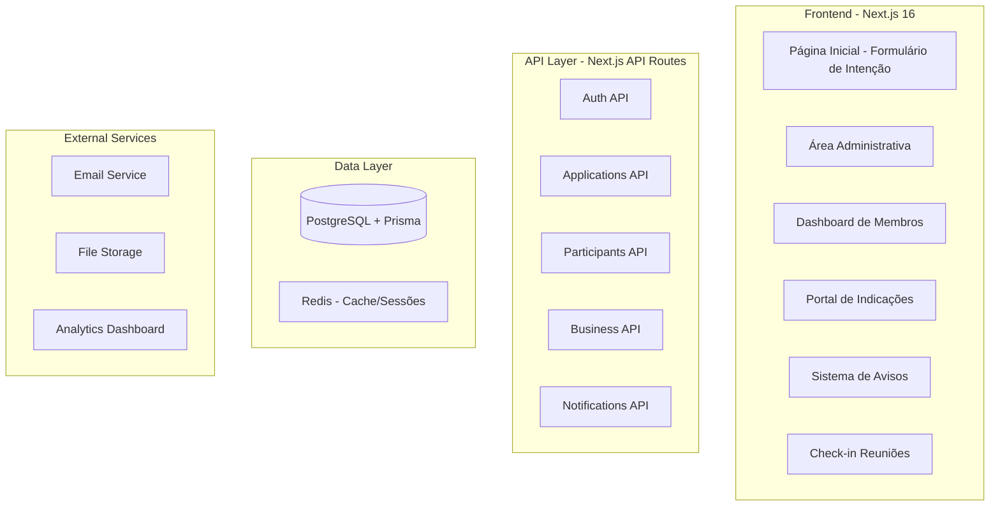

# 📐 Documento de Arquitetura - Sistema de Gestão de Networking

## 📋 Visão Geral

Este documento descreve a arquitetura completa do sistema de gestão de networking empresarial, projetado para gerenciar membros, comunicações, indicações de negócios e acompanhamento de performance.

## 🏗️ Arquitetura do Sistema



## 🗄️ Modelo de Dados

### **Escolha do Banco de Dados: PostgreSQL**

**Justificativa:**

- **Consistência ACID** essencial para dados financeiros e de negócios
- **Relações complexas** entre membros, indicações e pagamentos
- **Escalabilidade vertical e horizontal** para crescimento do grupo
- **Suporte nativo para JSON** quando necessário flexibilidade

### **Schema Completo do Banco**

```prisma
// Modelos principais já existentes
model Application {
  id                    Int      @id @default(autoincrement())
  nome                  String
  empresa               String?
  email                 String @unique
  motivo_participacao   String
  aprovado              Boolean @default(false)
  recusado              Boolean @default(false)
  codigo_convite        String? @unique
  registro_finalizado   Boolean @default(false)
  createdAt             DateTime @default(now())
  updatedAt             DateTime @updatedAt

  // Relações
  participant           Participant?
  notifications         Notification[]
  businessReferrals   BusinessReferral[] @relation("ReferrerMember")
  receivedReferrals   BusinessReferral[] @relation("ReceiverMember")

  @@map("applications")
}

model Participant {
  id                    Int      @id @default(autoincrement())
  application           Application @relation(fields: [id_intencao], references: [id])
  id_intencao           Int @unique
  nome                  String
  empresa               String?
  email                 String @unique
  telefone              String?
  rede_social           String?
  cpf_cnpj              String?
  descricao_habilidades String?
  status                ParticipantStatus @default(ACTIVE)
  createdAt             DateTime @default(now())
  updatedAt             DateTime @updatedAt

  // Novas relações
  payments              Payment[]
  meetings              Meeting[] @relation("ParticipantMeetings")
  checkins              MeetingCheckin[]
  thankYous             ThankYou[]
  analytics             ParticipantAnalytics?

  @@map("participants")
}

// NOVOS MODELOS PARA FUNCIONALIDADES COMPLETAS

model Notification {
  id              Int      @id @default(autoincrement())
  title           String
  content         String
  type            NotificationType
  applicationId   Int?
  application     Application? @relation(fields: [applicationId], references: [id])
  isRead          Boolean @default(false)
  createdAt       DateTime @default(now())

  @@map("notifications")
}

model BusinessReferral {
  id                Int      @id @default(autoincrement())
  title             String
  description       String
  referrerId        Int
  referrer        Application @relation("ReferrerMember", fields: [referrerId], references: [id])
  receiverId        Int
  receiver        Application @relation("ReceiverMember", fields: [receiverId], references: [id])
  status            ReferralStatus @default(PENDING)
  value             Decimal? @db.Decimal(10,2)
  expectedCloseDate DateTime?
  actualCloseDate   DateTime?
  notes             String?
  createdAt         DateTime @default(now())
  updatedAt         DateTime @updatedAt

  @@map("business_referrals")
}

model Meeting {
  id              Int      @id @default(autoincrement())
  title           String
  description     String?
  scheduledDate   DateTime
  duration        Int // em minutos
  type            MeetingType
  status          MeetingStatus @default(SCHEDULED)
  organizerId     Int
  participants    Participant[] @relation("ParticipantMeetings")
  checkins        MeetingCheckin[]
  createdAt       DateTime @default(now())

  @@map("meetings")
}

model MeetingCheckin {
  id              Int      @id @default(autoincrement())
  meetingId       Int
  meeting       Meeting @relation(fields: [meetingId], references: [id])
  participantId   Int
  participant   Participant @relation(fields: [participantId], references: [id])
  checkinTime     DateTime @default(now())
  checkoutTime    DateTime?

  @@unique([meetingId, participantId])
  @@map("meeting_checkins")
}

model Payment {
  id              Int      @id @default(autoincrement())
  participantId   Int
  participant   Participant @relation(fields: [participantId], references: [id])
  amount          Decimal @db.Decimal(10,2)
  dueDate         DateTime
  paymentDate     DateTime?
  status          PaymentStatus @default(PENDING)
  referenceMonth  DateTime
  createdAt       DateTime @default(now())

  @@map("payments")
}

model ThankYou {
  id              Int      @id @default(autoincrement())
  fromParticipantId Int
  fromParticipant Participant @relation(fields: [fromParticipantId], references: [id])
  toParticipantId   Int
  toParticipant   Participant @relation(fields: [toParticipantId], references: [id], name: "ThankYouTo")
  message         String
  businessReferralId Int?
  businessReferral BusinessReferral? @relation(fields: [businessReferralId], references: [id])
  createdAt       DateTime @default(now())

  @@map("thank_yous")
}

model ParticipantAnalytics {
  id              Int      @id @default(autoincrement())
  participantId   Int @unique
  participant   Participant @relation(fields: [participantId], references: [id])
  totalReferrals  Int @default(0)
  successfulReferrals Int @default(0)
  totalMeetings   Int @default(0)
  thankYousReceived Int @default(0)
  lastActivity    DateTime?
  createdAt       DateTime @default(now())
  updatedAt       DateTime @updatedAt

  @@map("participant_analytics")
}

// Enums
enum ParticipantStatus {
  ACTIVE
  INACTIVE
  SUSPENDED
}

enum NotificationType {
  ANNOUNCEMENT
  REMINDER
  REFERRAL_UPDATE
  PAYMENT_DUE
}

enum ReferralStatus {
  PENDING
  IN_PROGRESS
  CLOSED_WON
  CLOSED_LOST
}

enum MeetingType {
  WEEKLY_MEETING
  ONE_ON_ONE
  SPECIAL_EVENT
}

enum MeetingStatus {
  SCHEDULED
  IN_PROGRESS
  COMPLETED
  CANCELLED
}

enum PaymentStatus {
  PENDING
  PAID
  OVERDUE
  CANCELLED
}
```

## 🧩 Estrutura de Componentes (Frontend)

### **Organização de Pastas - Next.js App Router**

```
app/
├── (public)/
│   ├── page.tsx                 # Landing page com formulário de intenção
│   ├── login/                   # Login de participantes
│   └── convite/[code]/          # Registro via código de convite
├── (private)/
│   ├── dashboard/
│   │   ├── page.tsx             # Dashboard principal do participante
│   │   ├── indicacoes/          # Gerenciamento de indicações
│   │   ├── mensalidades/        # Visualização de pagamentos
│   │   └── meus-dados/          # Perfil do participante
│   └── admin/
│       ├── page.tsx              # Login admin
│       ├── (admin)/
│       │   ├── dashboard/        # Dashboard administrativo
│       │   ├── aplicacoes/       # Gerenciar aplicações pendentes
│       │   ├── participantes/    # CRUD participantes
│       │   ├── indicacoes/       # Monitorar indicações
│       │   ├── financeiro/       # Controle financeiro
│       │   ├── comunicados/      # Enviar avisos
│       │   ├── reunioes/         # Agendar reuniões
│       │   └── relatorios/       # Relatórios e analytics
├── api/
│   ├── auth/
│   ├── applications/
│   ├── participants/
│   ├── business-referrals/
│   ├── payments/
│   ├── notifications/
│   ├── meetings/
│   └── analytics/
└── layout.tsx                    # Layout principal com context providers

components/
├── ui/                          # Componentes base (shadcn/ui)
├── forms/                       # Formulários complexos
├── dashboard/                   # Componentes específicos de dashboard
├── charts/                      # Gráficos e visualizações
└── shared/                      # Componentes compartilhados

lib/
├── auth/                        # Autenticação e autorização
├── utils/                       # Funções utilitárias
├── hooks/                       # Custom hooks
├── types/                       # TypeScript types
└── constants/                   # Constantes da aplicação
```

### **Estado Global - Context API + Zustand**

```typescript
// stores/useAuthStore.ts
interface AuthStore {
  user: Participant | null;
  isAuthenticated: boolean;
  login: (email: string, password: string) => Promise<void>;
  logout: () => void;
}

// stores/useNotificationStore.ts
interface NotificationStore {
  notifications: Notification[];
  unreadCount: number;
  fetchNotifications: () => Promise<void>;
  markAsRead: (id: number) => Promise<void>;
}

// stores/useAnalyticsStore.ts
interface AnalyticsStore {
  dashboardData: DashboardData | null;
  loading: boolean;
  fetchDashboardData: () => Promise<void>;
}
```

## 🔌 Definição da API

### **1. Gestão de Membros**

#### **POST /api/applications**

```typescript
// Request
{
  nome: string;
  email: string;
  empresa?: string;
  motivo_participacao: string;
}

// Response - 201 Created
{
  success: true;
  data: {
    id: number;
    nome: string;
    email: string;
    status: "pending";
    createdAt: string;
  }
}
```

#### **PATCH /api/applications/:id/approve**

```typescript
// Request - Admin only
{
  approved: boolean;
  inviteCode?: string;
}

// Response - 200 OK
{
  success: true;
  data: {
    id: number;
    approved: boolean;
    inviteCode: string;
  }
}
```

### **2. Sistema de Indicações**

#### **POST /api/business-referrals**

```typescript
// Request
{
  title: string;
  description: string;
  receiverId: number;
  expectedCloseDate?: string;
  value?: number;
}

// Response - 201 Created
{
  success: true;
  data: {
    id: number;
    title: string;
    status: "pending";
    createdAt: string;
  }
}
```

#### **PATCH /api/business-referrals/:id/status**

```typescript
// Request
{
  status: "in_progress" | "closed_won" | "closed_lost";
  notes?: string;
  actualCloseDate?: string;
}

// Response - 200 OK
{
  success: true;
  data: {
    id: number;
    status: string;
    updatedAt: string;
  }
}
```

### **3. Controle Financeiro**

#### **POST /api/payments/generate**

```typescript
// Request - Admin only
{
  participantIds: number[];
  amount: number;
  dueDate: string;
  referenceMonth: string;
}

// Response - 201 Created
{
  success: true;
  data: {
    generatedPayments: number;
    payments: Payment[];
  }
}
```

#### **GET /api/payments/my-payments**

```typescript
// Response - 200 OK
{
  success: true;
  data: {
    pending: Payment[];
    paid: Payment[];
    overdue: Payment[];
    totalPending: number;
  }
}
```

### **4. Comunicação e Avisos**

#### **POST /api/notifications/broadcast**

```typescript
// Request - Admin only
{
  title: string;
  content: string;
  type: "announcement" | "reminder";
  targetAudience?: "all" | "active" | "overdue";
}

// Response - 201 Created
{
  success: true;
  data: {
    notificationId: number;
    recipients: number;
  }
}
```

### **5. Analytics e Relatórios**

#### **GET /api/analytics/dashboard**

```typescript
// Response - 200 OK
{
  success: true;
  data: {
    totalMembers: number;
    activeReferrals: number;
    closedDeals: number;
    totalRevenue: number;
    monthlyGrowth: number;
    topReferrers: TopReferrer[];
    recentActivities: Activity[];
  }
}
```

#### **GET /api/analytics/reports?period=monthly&startDate=2024-01-01**

```typescript
// Response - 200 OK
{
  success: true;
  data: {
    period: string;
    memberGrowth: number;
    referralMetrics: {
      total: number;
      successRate: number;
      averageValue: number;
    }
    financialMetrics: {
      revenue: number;
      overduePayments: number;
      paymentRate: number;
    }
    engagementMetrics: {
      averageAttendance: number;
      activeMembers: number;
      thankYousGiven: number;
    }
  }
}
```

## 🔐 Segurança e LGPD

### **Medidas de Segurança**

- **Autenticação JWT** com refresh tokens
- **Rate limiting** por IP e usuário
- **Criptografia** de dados sensíveis (CPF/CNPJ)
- **HTTPS obrigatório** em produção
- **Validação de entrada** com Zod

## 🚀 Escalabilidade e Performance

### **Estratégias de Cache**

- **Redis** para sessões e dados frequentes
- **Cache de consultas** no Prisma
- **CDN** para assets estáticos
- **Pagination** em listagens grandes

## 📊 Stack Tecnológico Final

| Camada       | Tecnologia                        | Justificativa                   |
| ------------ | --------------------------------- | ------------------------------- | -------------------------------------------------------------------- |
| **Frontend** | Next.js 16, React 19, TypeScript  | SSR/SSG, performance, SEO       |
| **UI**       | Tailwind CSS, Radix UI, shadcn/ui | Design system consistente       |
| **Backend**  | Next.js API Routes, tRPC          | Full-stack type-safe            | Ou Backend Separado com Nest.js                                      |
| **Banco**    | PostgreSQL 15, Prisma ORM         | ACID, relacionamentos complexos |
| **Cache**    | Redis 7                           | Performance e sessões           |
| **Auth**     | NextAuth.js v4                    | Segurança e múltiplos providers | Ou Auth Separada com Keycloak ou então jwt com Nest.js e duplo fator |
| **Deploy**   | Vercel/ AWS                       | Escalabilidade e CI/CD          |
| **Email**    | Resend/ AWS SES                   | Entregabilidade                 |
| **Storage**  | AWS S3                            | Arquivos e documentos           |

---
